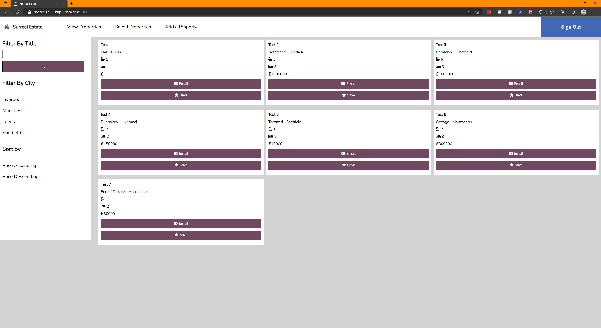
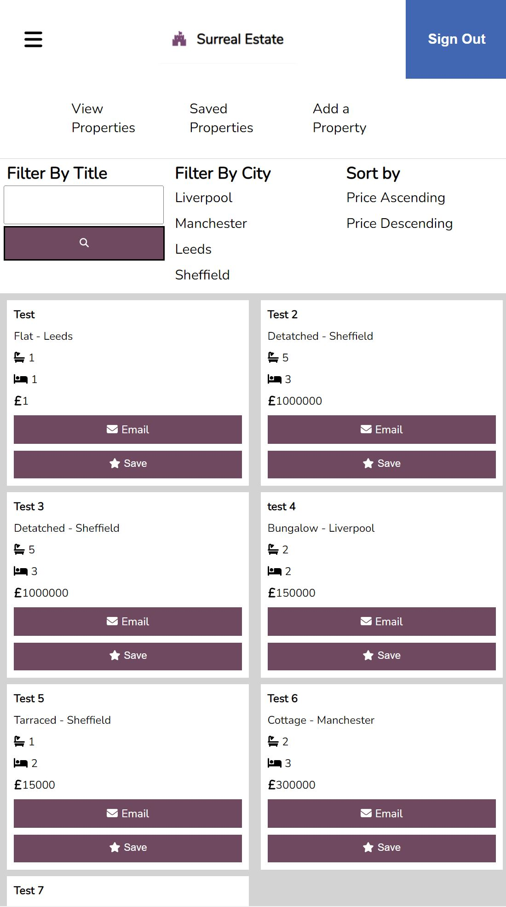
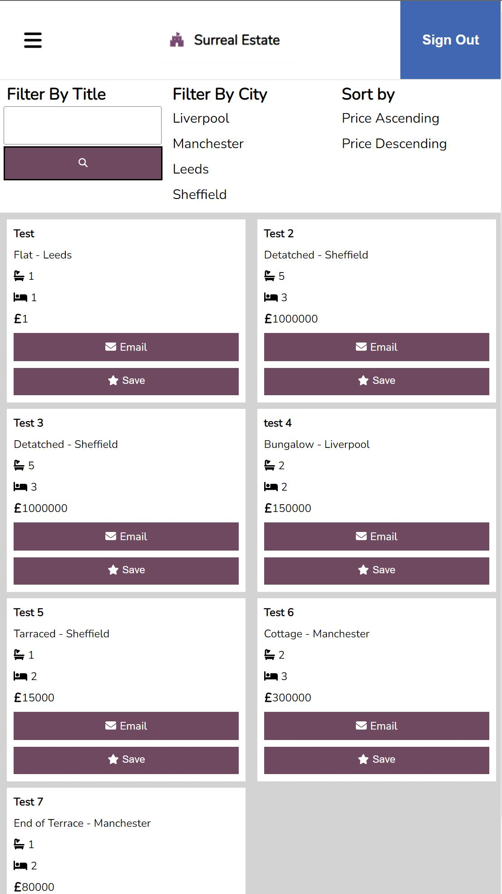
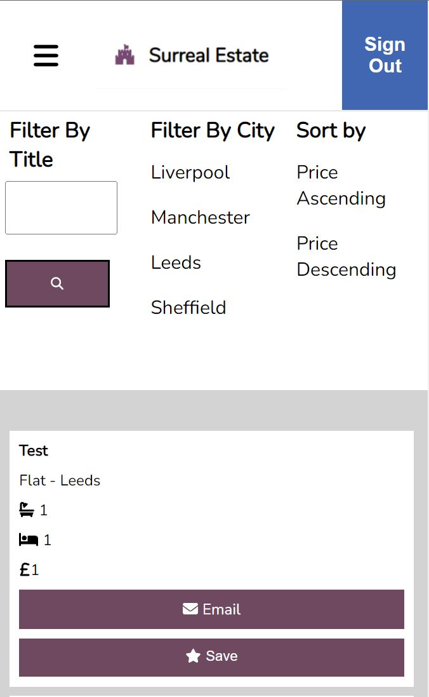

# Surreal Estate

A Single Page Application built using React that will allow you to add and search property listings, as well as save and remove your favourite listings. You can filter listings by the title of the listing, or you can filter by city or sort by price ascending or descending.

## Screenshots

### Desktop

### Tablet

### Mobile

## Technologies Used

### Language

- React (using `create-react-app`)

### Testing Utilities

- Jest
- React Testing Library

### Packages

- Axios
- PropTypes
- SASS
- React Facebook Login
- FontAwesome

## Instructions

- Clone this repo and `cd` into it in your IDE
- Run `npm install`
- Run `npm start`
- Clone and run the Surreal-Estate-API in docker: [Surreal Estate API](https://github.com/MCRcodes/surreal-estate-api)

## If I had more time

- Fix the logout button, it retains the old facebook hash value and will just regenerate a new one when you login. Only happens if you logout after reloading the site and doesn't stop the actual functionality from working.
- Fix the nav styling on smaller desktops, so it doesn't bleed into other elements on the page.
- Have a way to reset all filters without needing to reload the app.

## Author

- Will Hodgkinson
